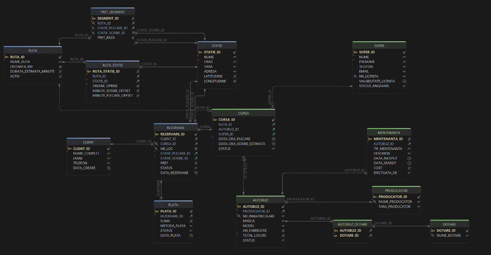

# 🚌 BUSNOVA – Sistem de Management al Transportului de Pasageri

## 📌 Descriere Generală

**BUSNOVA** reprezintă implementarea unei baze de date pentru administrarea unei firme de transport pasageri, realizată în mediul **Oracle Database**.

Sistemul gestionează:

- 🚍 Flota de vehicule
- 🗺️ Programarea curselor
- 🎟️ Procesul de rezervare al locurilor

Arhitectura este construită pe o logică de business orientată spre:

- Flexibilitate tarifară
- Optimizarea gradului de ocupare
- Integritate și consistență a datelor

---

## 🏗️ Elemente Cheie ale Proiectului

### 1️⃣ Modelarea Itinerariilor (`RUTA_STATIE`)

Sistemul utilizează un tabel asociativ complex pentru definirea succesiunii stațiilor din cadrul unei rute.

#### 🔹 Funcționalități principale:

- **Succesiune logică a opririlor**  
  Atributul `ordine_oprire` stabilește ordinea exactă a stațiilor într-o rută.

- **Gestiunea timpului prin offset-uri**  
  Sunt utilizați indici de decalaj pentru calcularea:
  - timpului estimat de sosire
  - timpului estimat de plecare  
    pentru fiecare stație intermediară.

- **Integritate a datelor**  
  Constrângeri de unicitate previn duplicarea unei stații în cadrul aceleiași rute.

---

### 2️⃣ Tarifarea pe Segmente de Drum (`PRET_SEGMENT`)

Modelul permite definirea unei politici tarifare granulare, esențială pentru rutele cu multiple opriri.

#### 🔹 Caracteristici:

- **Definire explicită a prețului**  
  Prețurile sunt stabilite între stații specifice de plecare și sosire, fără a depinde de un calcul automat per kilometru.

- **Flexibilitate comercială**  
  Arhitectura permite:
  - definirea unor prețuri preferențiale
  - tarife reduse pentru segmente lungi
  - prețuri speciale pentru ruta completă

---

### 3️⃣ Gestiunea Dinamică a Rezervărilor

Sistemul tratează ocuparea locurilor raportat strict la segmentul de drum parcurs.

#### 🔹 Principiu de funcționare:

- **Refolosirea locurilor**  
  Un loc este considerat ocupat doar între stația de urcare și cea de coborâre.  
  Acesta devine disponibil automat pentru restul traseului.

- **Validare automată prin Trigger (PL/SQL)**  
  Înainte de confirmarea rezervării, un mecanism verifică:
  - disponibilitatea locului
  - suprapunerea segmentelor
  - consistența datelor

---

## 🗺️ Diagrama Conceptuală

---

## 🛠️ Implementare SQL & PL/SQL

### 🔍 Analiză Avansată

Sistemul include interogări complexe pentru raportare și analiză:

- Funcții analitice:
  - `RANK`
  - `DENSE_RANK`
- Interogări ierarhice pentru afișarea structurii rutelor

---

### ⚙️ Automatizare prin Triggere

#### 🔸 LMD (DML)

- Verificarea automată a stării de mentenanță a autobuzelor la programarea curselor noi
- Validarea rezervărilor pe segmente de traseu

#### 🔸 LDD (DDL)

- Monitorizarea și auditarea modificărilor structurale asupra bazei de date

---

### 📝 Sistem de Logging

Toate evenimentele importante sunt înregistrate într-un tabel dedicat:

- Erori
- Confirmări de proces
- Evenimente automate
- Modificări structurale

Acest mecanism permite monitorizarea și auditarea completă a sistemului.

---

## 📈 Posibile Extensii

- Interfață web pentru rezervări online
- Sistem de notificări pentru pasageri
- Integrare cu sisteme externe de plată
- Dashboard de analiză în timp real

---
